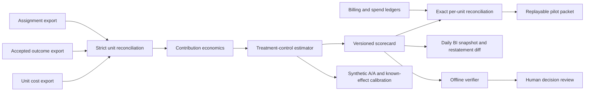
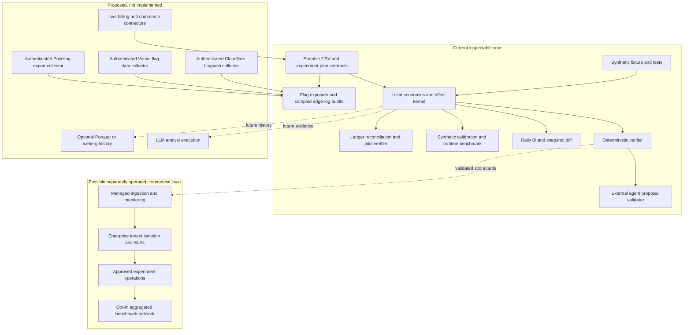

# Marketing Analytics & Incrementality Testing — Growth Decision Engine

**Inspectable marketing analytics for the business value of product and campaign experiments.** The current release takes customer-controlled CSV exports of assignment, accepted outcomes, unit costs, and transaction-level billing and spend. It reconciles every randomized unit and ledger amount, calculates contribution profit, estimates treatment-minus-control effects, applies a declared experiment plan, and emits deterministic scorecards and pilot packets that can be verified offline. The bundled data is entirely synthetic.

This is a local measurement kernel with a read-only evidence contract for external analyst agents. Optional Google/AX, Laya/Jev and Cognee adapters produce synthetic execution manifests or advisory review sidecars. It is **not** a deployed marketing platform, a live PostHog/Cloudflare/Vercel connector, an autonomous campaign agent, or proof that a real experiment increased profit.

## Try it in one command

From this repository root, with Python 3.10 or newer:

```bash
python3 -m growth_decision_engine demo --output outputs/demo-scorecard.json
python3 -m growth_decision_engine verify \
  --assignments growth_decision_engine/fixtures/assignments.synthetic.csv \
  --outcomes growth_decision_engine/fixtures/outcomes.synthetic.csv \
  --costs growth_decision_engine/fixtures/costs.synthetic.csv \
  --plan growth_decision_engine/fixtures/plan.synthetic.json \
  --scorecard outputs/demo-scorecard.json
python3 -m unittest discover -s tests -v
python3 -m growth_decision_engine calibrate --output outputs/calibration-synthetic.json
```

Use your own **permitted, de-identified** exports with `score`:

```bash
python3 -m growth_decision_engine score \
  --assignments assignments.csv --outcomes outcomes.csv --costs costs.csv \
  --plan plan.json \
  --output outputs/my-scorecard.json

python3 -m growth_decision_engine bi-diff \
  outputs/previous-scorecard.json outputs/my-scorecard.json
```

`verify` recomputes the entire scorecard from the supplied files and plan. `bi-diff` identifies changed source hashes and added, removed, or restated date/arm BI rows between snapshots. These commands do **not** authenticate source systems, prove that treatment assignment preceded outcomes, or prove that a plan was truly pre-registered. No file is uploaded and no account is modified.

For a read-only pilot, `pilot` additionally reconciles signed billing transactions (including refunds) and five cost categories to every scored unit, then writes a replayable packet with source hashes and a pending human-review status. Run `verify-pilot` against the same exports before review. The [pilot contract and synthetic commands](docs/read-only-pilot.md) specify the manifest, ledgers and failure cases. Permission and source identity remain operator declarations; no customer pilot has been completed by this repository.

`snapshot-pilot` provides an optional [private local source snapshot](docs/local-source-snapshot.md): it copies the seven inputs once into a new directory outside Git, runs the pilot on those copies, and records file hashes for `verify-snapshot`. It stabilizes replay across multi-pass reconciliation but does not authenticate the original exports or encrypt the bundle.

`monitor-snapshots` accepts those directories directly, avoiding a hand-written seven-path BI series. Each snapshot has an inventory SHA-256 receipt; keep that digest independently and pass it to `verify-snapshot` or `monitor-snapshots` to detect wholesale bundle replacement. A hash is only as trustworthy as the place that holds the expected value.

`render-report` creates a [private offline HTML review](docs/pilot-review-report.md) from a verified snapshot. It presents aggregate economics, uncertainty, plan gates and provenance to a nontechnical reviewer without embedding source rows, scripts or external assets. The report is informational and keeps the synthetic/unverified claim visible.

The [provider export audits](docs/provider-export-audits.md) check customer-projected PostHog or Vercel flag events against the assignment census and summarize allowlisted Cloudflare HTTP Logpush records with sampling explicit. These are local, synthetic-tested contracts; they neither authenticate to providers nor replace randomized assignments. No provider-native export has yet been validated.

External analyst agents can submit a proposal JSON to `python3 -m growth_decision_engine proposal-check --scorecard outputs/demo-scorecard.json --proposal proposal.json`. The validator pins the exact report hash, resolves cited metric paths, and permits only review-oriented next steps. It checks **structural grounding**, not whether the natural-language finding is statistically sound. See [the proposal contract](docs/agent-proposals.md).

For repeatable **local continuous BI**, `bi-monitor` replays a bounded sequence of pilot packets against each packet's declared exports before reporting freshness, latest daily-BI restatements, plan changes, and failed plan gates. `alert-review-template` and `alert-review-eval` bind two pseudonymous reviewer labels to the exact monitor report, leaving disagreements unresolved. `proposal-bench` checks the proposal validator against five labeled synthetic cases; one deliberately false sentence passes because a real citation exists. These are review tools, not a live monitor or semantic fact checker. See [continuous BI and proposal evaluation](docs/continuous-bi.md).

`change-preflight` produces a **non-authorizing** review packet for a bounded feature-flag increase after replaying two pilot packets. It checks exact evidence replay, positive plan signals, a declared spend cap, expiry and rollback target, but never authenticates an operator or writes to a platform. The current synthetic fixture is inconclusive and is blocked. See [the offline change preflight contract](docs/change-preflight.md).

The [Google/AX, Laya/Jev and Cognee integration guide](docs/agent-runtime-and-context-integrations.md) describes a pinned AX Task manifest for the synthetic demo, optional typed shadow review suggestions, and untrusted Cognee context sidecars. The default fixture paths run without network access or model weights. No live provider or AX cluster is validated here; provider outputs cannot change the scorecard or authorize campaign operations.

## Data contract

The three CSVs use one row per randomized unit and **exactly** these columns:

| File | Columns | Meaning |
| --- | --- | --- |
| `assignments.csv` | `unit_id,arm,assigned_at` | One pre-outcome assignment to `control` or `treatment` |
| `outcomes.csv` | `unit_id,observed_at,accepted,net_revenue_usd,variable_cost_usd` | Accepted paid conversion, revenue after refunds, and variable fulfillment/payment costs |
| `costs.csv` | `unit_id,media_cost_usd,inference_cost_usd,infrastructure_cost_usd,experiment_cost_usd` | Costs allocated to that same unit |
| `plan.json` | Versioned experiment design | Fixed assignment and observation windows, expected allocation, minimum sample, contribution threshold and cost guardrail |

Timestamps must be UTC ISO-8601; amounts are nonnegative USD with at most two decimal places. Each input is capped at 64 MiB and 25,000 units for local memory safety; the bootstrap is capped at 20 million unit draws. Larger workloads require a measured scale-out evaluator. The three unit sets must match exactly, each arm needs at least two units, and every outcome time must follow its assignment time. `accepted=0` requires zero net revenue. Missing, duplicate, extra, malformed, or contradictory records fail closed. A supplied plan also constrains assignment and observation dates. Operationally, the experiment owner must document the randomization unit, attribution window, refund policy, cost allocation, exclusions, and interference risks before using results for decisions.

For each unit:

```text
contribution profit = net revenue - variable cost - media cost
                    - inference cost - infrastructure cost - experiment cost
```

The versioned scorecard reports per-arm means and treatment-minus-control differences in accepted conversion, revenue, **each cost category**, total cost and contribution profit; descriptive cost and contribution per accepted conversion; a seeded within-arm percentile-bootstrap interval for contribution effect; and daily date/arm economic totals. Per-accepted costs include spending on non-converting units divided by the number of accepted conversions. The plan diagnostic checks sample size, sample-ratio mismatch, and the incremental cost guardrail. Its statuses are **review signals**, never automatic rollout permission. This is an **intent-to-treat estimate only if** assignment was genuinely random, units were independent, outcomes were complete, and treatment did not affect control. The interval does not repair flawed assignment, repeated peeking, selection bias, spillover, or underpowered tests.

The CSV contract remains compatible with the first release; the report protocol is now `growth-decision/v2` because the output gained plan and BI fields. Old v1 scorecards must be regenerated from their original inputs before comparison. The source files and plan are SHA-256 hashed, but hashes are not digital signatures or proof of provenance.

## Statistical calibration and runtime evidence

`calibrate` reuses the **same interval estimator** as `score` on independently generated synthetic A/A and known-effect A/B experiments. It reports a null false-positive rate, known-effect interval coverage, positive-detection rate, and 95% Wilson bands for Monte Carlo uncertainty. With the default seed, 100 replications, 80 units per arm, 200 bootstrap resamples and a $3 known effect, the synthetic diagnostic returned **4/100 null false positives, 89/100 intervals containing the true effect, and 8/100 positive detections**. These are observed counts for one deliberately skewed distribution, not guarantees or field performance. In particular, the low detection rate warns against treating an inconclusive scorecard as evidence of no effect. See [evaluation protocol](docs/evaluation-protocol.md) for the assumptions and reproducible commands.

The full CSV-to-scorecard benchmark is also executable locally:

```bash
python3 -m benchmarks.score_runtime --units 1000 --resamples 200
python3 -m benchmarks.score_runtime --units 10000 --resamples 200
```

On one macOS arm64 host with Python 3.14.7, those runs took 0.2396 s and 2.3669 s, with 1.64 MB and 15.96 MB peak **traced Python allocations**, respectively. File generation is excluded; CSV parsing, reconciliation, economics and bootstrap are included. These are single-run machine measurements, not an SLA, peak process RSS, or proof of scaling beyond the 25,000-unit cap.

## Architecture





## Roadmap and release gates

| Gate | Deliverable | Evidence required |
| --- | --- | --- |
| 0 — complete | Synthetic local scorer, plan gates, daily BI, verifier, CI and calibration harness | Reproducible output, malformed-input rejection, measured estimator limits, no live claims |
| 1 — offline tooling shipped; real pilot pending | Read-only signup-to-paid pilot packet with transaction-level billing and cost reconciliation | Customer permission and locked plan outside CLI, customer exports, independent source-completeness check, human review |
| 2 — local audits shipped; native validation pending | PostHog/Vercel flag-evaluation projections and Cloudflare Logpush context audits | Contract tests against permitted native exports, provider source counts, event-loss and join-error measurements |
| 3 — local monitor and review contract shipped; field validation pending | Replay-verified pilot history, freshness and restatement alerts, two-reviewer adjudication, structural proposal suite | Real export cadence, measured runtime/query cost, actual reviewer labels, proposal semantic-support tests and acceptance |
| 4 — offline preflight shipped; operational integration pending | Two-packet replay and bounded change review packet | Independently reviewed lift replication, authenticated approval, enforced live spend limits, tested rollback, operator override audit |

The first partner-facing feature would be **contribution profit per accepted conversion for a feature-flag experiment**. A second would use Cloudflare request context in a customer-approved workflow; a causal join would require a separately validated, privacy-preserving unit linkage and complete assignment census. Neither platform partnership is assumed. The durable commercial offering would be managed operations, enterprise isolation, customer-specific economics, and carefully consented cross-customer benchmarks—not exclusive ownership of a platform's basic telemetry.

For the detailed [read-only pilot](docs/read-only-pilot.md), [private local snapshots](docs/local-source-snapshot.md), [offline pilot review report](docs/pilot-review-report.md), [provider export audits](docs/provider-export-audits.md), [continuous BI and alert review](docs/continuous-bi.md), [offline change preflight](docs/change-preflight.md), [agent runtime and context integrations](docs/agent-runtime-and-context-integrations.md), [production architecture](docs/production-architecture.md), [evaluation protocol](docs/evaluation-protocol.md), [keyword and search strategy](docs/keyword-strategy.md), and [inspectable/commercial boundary](docs/commercial-boundary.md), see `docs/`. The phrase *marketing analytics* leads the title because a recent relative Google Trends comparison in the A2Z ecosystem found stronger interest than narrower phrases; this is **not** a claim of absolute monthly search volume.

## Relationship to existing A2Z projects

- [AttentionOS Bench](https://github.com/AAH20/attentionos-bench) handles campaign-level incrementality and first-party marketing BI; this repository starts with product-level signup-to-paid economics.
- [Outcome Fabric](https://github.com/AAH20/outcome-fabric) defines accepted outcome evidence; an adapter is proposed, not yet shipped.
- [Audience Swarm Lab](https://github.com/AAH20/audience-swarm-lab) can rehearse hypotheses with synthetic audiences; it cannot validate real demand.
- [Commerce Incident Network](https://github.com/AAH20/commerce-incident-network) and Merchant Profit OS can inform a later commerce vertical.

Do not commit customer exports, credentials, or identifying user data. Future connectors should use customer-granted read-only access and preserve data provenance and deletion controls.
