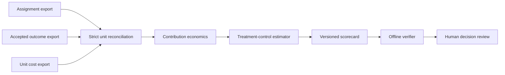
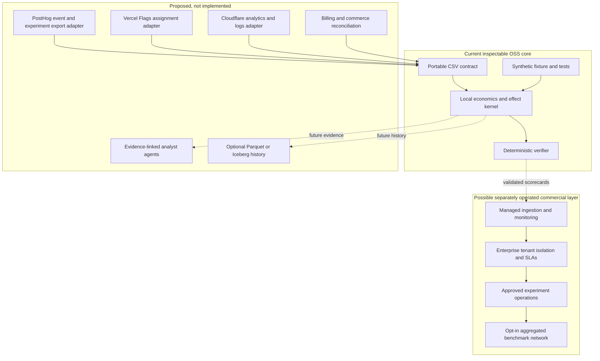

# Growth Decision Engine

**Open-source experiment-to-profit scorecards for product and marketing decisions.** The first release takes customer-controlled CSV exports of assignment, accepted outcomes, and unit costs. It reconciles every randomized unit, calculates contribution profit, estimates treatment-minus-control effects, and emits a deterministic scorecard that can be verified offline. The bundled data is entirely synthetic.

This is a local measurement kernel, **not** a deployed marketing platform, a live PostHog/Cloudflare/Vercel connector, an autonomous campaign agent, or proof that a real experiment increased profit.

## Try it in one command

From this repository root, with Python 3.10 or newer:

```bash
python3 -m growth_decision_engine demo --output outputs/demo-scorecard.json
python3 -m growth_decision_engine verify \
  --assignments growth_decision_engine/fixtures/assignments.synthetic.csv \
  --outcomes growth_decision_engine/fixtures/outcomes.synthetic.csv \
  --costs growth_decision_engine/fixtures/costs.synthetic.csv \
  --scorecard outputs/demo-scorecard.json
python3 -m unittest discover -s tests -v
```

Use your own **permitted, de-identified** exports with `score`:

```bash
python3 -m growth_decision_engine score \
  --assignments assignments.csv --outcomes outcomes.csv --costs costs.csv \
  --output outputs/my-scorecard.json
```

`verify` recomputes the entire scorecard from the supplied files. It catches changed files, altered calculations, and altered report values; it does **not** authenticate source systems or prove that treatment assignment preceded the outcome. No file is uploaded and no account is modified.

## Data contract

The three CSVs use one row per randomized unit and **exactly** these columns:

| File | Columns | Meaning |
| --- | --- | --- |
| `assignments.csv` | `unit_id,arm,assigned_at` | One pre-outcome assignment to `control` or `treatment` |
| `outcomes.csv` | `unit_id,observed_at,accepted,net_revenue_usd,variable_cost_usd` | Accepted paid conversion and net revenue after refunds |
| `costs.csv` | `unit_id,media_cost_usd,inference_cost_usd,infrastructure_cost_usd,experiment_cost_usd` | Costs allocated to that same unit |

Timestamps must be UTC ISO-8601; amounts are nonnegative USD with at most two decimal places. The three unit sets must match exactly, each arm needs at least two units, and every outcome time must follow its assignment time. `accepted=0` requires zero net revenue. Missing, duplicate, extra, malformed, or contradictory records fail closed. Operationally, the experiment owner must document the randomization unit, attribution window, refund policy, cost allocation, exclusions, and interference risks before using results for decisions.

For each unit:

```text
contribution profit = net revenue - variable cost - media cost
                    - inference cost - infrastructure cost - experiment cost
```

The scorecard reports per-arm means, treatment-minus-control differences in accepted conversion, revenue, cost and contribution profit, plus a seeded within-arm percentile-bootstrap interval for contribution effect. This is an **intent-to-treat estimate only if** assignment was genuinely random, units were independent, outcomes were complete, and treatment did not affect control. The interval does not repair flawed assignment, repeated peeking, selection bias, spillover, or underpowered tests.

## Architecture





## Roadmap and release gates

| Gate | Deliverable | Evidence required |
| --- | --- | --- |
| 0 — current | Synthetic local scorer and verifier | Reproducible output, malformed-input rejection, no live claims |
| 1 | Read-only SaaS signup-to-paid pilot | Written data permission, locked experiment plan, billing/cost reconciliation, human review |
| 2 | PostHog/Vercel/Cloudflare export adapters | Contract tests against permitted exports, event-loss and join-error measurements |
| 3 | Continuous BI and agent-assisted analysis | Freshness, query-cost, false-alert, citation and recommendation-acceptance benchmarks |
| 4 | Approved operational integration | Independent lift replication, spend limits, rollback, operator override audit |

The first partner-facing feature would be **contribution profit per accepted conversion for a feature-flag experiment**. A second would join Cloudflare event data to downstream accepted outcomes while making sampling and retention explicit. Neither platform partnership is assumed. The durable commercial offering would be managed operations, enterprise isolation, customer-specific economics, and carefully consented cross-customer benchmarks—not exclusive ownership of a platform's basic telemetry.

## Relationship to existing A2Z projects

- [AttentionOS Bench](https://github.com/AAH20/attentionos-bench) handles campaign-level incrementality and first-party marketing BI; this repository starts with product-level signup-to-paid economics.
- [Outcome Fabric](https://github.com/AAH20/outcome-fabric) defines accepted outcome evidence; an adapter is proposed, not yet shipped.
- [Audience Swarm Lab](https://github.com/AAH20/audience-swarm-lab) can rehearse hypotheses with synthetic audiences; it cannot validate real demand.
- [Commerce Incident Network](https://github.com/AAH20/commerce-incident-network) and Merchant Profit OS can inform a later commerce vertical.

Do not commit customer exports, credentials, or identifying user data. Future connectors should use customer-granted read-only access and preserve data provenance and deletion controls.
