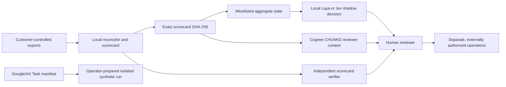

# Google/AX, Laya/Jev, and Cognee adapters

These adapters extend the **review workflow**, not the measurement kernel. The scorecard remains the sole output of reconciled local source files. Provider suggestions and retrieved text are separate, hash-bound sidecars with no execution authority. All bundled examples are synthetic. No live provider, Kubernetes cluster, model checkpoint, or customer dataset has been validated by this repository.



## Google/AX: portable synthetic Task manifest

`ax-task` emits a JSON document (valid YAML 1.2) using the Google/AX `ax.io/v1alpha1` Task schema. It runs the **bundled synthetic demo** in an operator-built OCI image pinned by digest and an operator-provisioned AX Workspace. It does not create an AX cluster, apply the manifest, pull an image, mount private evidence, expose a gateway, or set credentials. The operator must ensure the pinned image contains this installed package, the workspace has the repo and writable `outputs/`, and the AX version still accepts this early schema. Inspect with an AX installation before applying.

```bash
python3 -m growth_decision_engine ax-task \
  --image 'registry.example/gde@sha256:aaaaaaaaaaaaaaaaaaaaaaaaaaaaaaaaaaaaaaaaaaaaaaaaaaaaaaaaaaaaaaaa' \
  --workspace synthetic-workspace --output outputs/ax-task.json
```

The digest above is a **placeholder**, not an existing image. No remote execution is performed by the command.

## Laya / Jev: typed shadow decision

`decision-shadow` asks exactly one closed-set `choice` question about the **next review activity**: audit sources, extend an experiment, design a follow-up, or human review. The provider receives only an allowlist of aggregate counts, effects, interval, claim, decision status and gate booleans. No unit rows, customer names, source paths, plan identifiers or credentials are sent. The output preserves the original scorecard hash and decision status. It cannot recommend or authorize a campaign rollout.

Verify the scorecard from its source files with `verify` before using any adapter. These adapters hash the supplied scorecard but cannot independently prove it was honestly generated. A scorecard must include a valid experiment plan for the shadow decision input.

```bash
python3 -m growth_decision_engine decision-shadow \
  --scorecard outputs/demo-scorecard.json --provider fixture \
  --output outputs/shadow-fixture.json
```

For Laya, install and cache its model weights separately. The adapter forces offline Hugging Face/Transformers environment variables before importing Laya, then calls `Router(preload=False).predict(state, questions)` locally. This repo does not declare Laya as a default dependency, ship weights, benchmark its decision accuracy, or verify network behavior of every Laya release.

```bash
python3 -m growth_decision_engine decision-shadow \
  --scorecard outputs/demo-scorecard.json --provider laya \
  --output outputs/shadow-laya.json
```

For Jev, set `TYPESAFE_API_KEY` in the process environment and pass `--allow-network`. The adapter posts the bounded aggregate state and typed question to TypeSafe's fixed HTTPS `/v1/systemone` endpoint with `model=jev-latest`. The key is never included in the output. Use only data you are authorized to send to TypeSafe. A real Jev call requires credentials and has **not** been tested here; the default suite mocks the HTTP boundary.

```bash
python3 -m growth_decision_engine decision-shadow \
  --scorecard outputs/demo-scorecard.json --provider jev --allow-network \
  --output outputs/shadow-jev.json
```

Invalid or out-of-set choices are rejected. A valid choice is still **advisory**, and neither Laya nor Jev confidence is calibrated by this project. To measure value, collect reviewer labels on a held-out case set, compare accuracy, abstention, latency, and cost with a simple non-model baseline, and keep false recommendations visible.

## Cognee: retrieved context sidecar

`cognee-context` accepts an operator-saved Cognee `CHUNKS` search response or queries a **loopback-only** Cognee HTTP server at `/api/v1/search`. It records at most ten short excerpts, content hashes and any supplied source IDs. IDs are explicitly marked *unverified*: retrieval does not prove origin, correctness, completeness, or permission. Retrieved text is untrusted and never enters the scorecard calculation or provider decision input. Dataset scoping and authentication must be enforced by the operator's Cognee instance; this adapter sends no private source rows to Cognee. A configured server may still expose other data to the query, so use an isolated dataset and inspect access controls.

```bash
python3 -m growth_decision_engine cognee-context \
  --scorecard outputs/demo-scorecard.json \
  --query 'refund reconciliation review' \
  --response-file growth_decision_engine/fixtures/cognee-chunks.synthetic.json \
  --output outputs/cognee-context.json

# If a local Cognee server is already running and appropriately configured:
python3 -m growth_decision_engine cognee-context \
  --scorecard outputs/demo-scorecard.json \
  --query 'refund reconciliation review' \
  --base-url http://127.0.0.1:8000 --allow-network \
  --output outputs/cognee-context-local.json
```

## Release gates

| Gate | Current state | Needed for operational use |
| --- | --- | --- |
| Protocol and safety boundary | Local contract tests pass; default demo is offline | Native version compatibility tests and negative cases |
| AX execution | Manifest generator only | Pinned image build, AX schema check, isolated cluster smoke test |
| Laya | Injectable router contract tested | Pinned checkpoint, offline installation, labeled benchmark |
| Jev | HTTP payload and strict response mocked | Consented live call, privacy review, latency and cost benchmark |
| Cognee | Saved CHUNKS response and local HTTP contract tested | Native instance test, source reference verification, dataset isolation test |
| Customer pilot | No external provider validated | Customer permission, source completeness, independent review |

The adapter surfaces are intentionally small because Google/AX and the model APIs are evolving. Version pinning and measured native compatibility should precede any production claim. Refer to the [Google/AX manifest reference](https://github.com/google/ax/blob/main/docs/manifests.md), [Laya repository](https://github.com/NandhaKishorM/laya), [TypeSafe API documentation](https://docs.typesafe.ai/introduction), and [Cognee API reference](https://docs.cognee.ai/api-reference/introduction) before upgrading the adapters.
