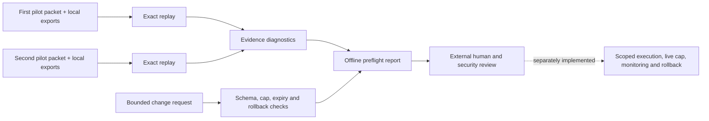

# Offline change preflight

`change-preflight` is a **local preparation step**, not an approval service or a platform connector. It replays two pilot packets against their supplied exports, checks that both declared experiments have positive review signals and passed plan gates, and checks a bounded feature-flag change request. The result is either `blocked_for_review` or `eligible_for_external_review`. `execution_enabled` is always `false`.



## Request contract

The request is a JSON object with exactly `schema_version`, `as_of`, `evidence`, and `change`. `schema_version` is `growth-decision-change-request/v1`. `as_of` is an explicit UTC timestamp. `evidence` contains **exactly two** entries, each with `packet`, `assignments`, `outcomes`, `costs`, `billing`, `spend`, `plan`, `manifest`, `seed`, and `resamples`. Paths are resolved relative to the request file unless absolute. Keep all customer data and the request file in a private local directory.

The `change` object requires:

| Field | Contract |
| --- | --- |
| `request_id`, `owner_id` | Short pseudonymous identifiers; these are declarations, not authenticated identities |
| `kind` | `feature_flag_rollout` only |
| `current_percent`, `target_percent` | Integer percentages; increase must be 1–10 points |
| `rollback_percent` | Exactly the current percentage |
| `max_additional_spend_usd` | Positive USD string with at most two decimal places; maximum $1,000,000 for input bounding |
| `spend_window_hours` | Integer 1–168 |
| `expires_at` | UTC timestamp after `as_of` and within the declared spend window |
| `ticket_reference` | Local operator declaration, not an approval credential |

Example command:

```bash
python3 -m growth_decision_engine change-preflight \
  --request /path/to/private/change-request.json \
  --output /path/to/private/change-preflight.json
```

The preflight fails closed on malformed fields, tampered packets, a cutoff after `as_of`, an invalid cap/window, missing rollback, or a rollout step over ten points. It reports review blockers when experiment IDs match, unit types differ, any assignment/outcome/cost source file is byte-identical, either scorecard lacks a positive signal with all plan gates, or a bundled synthetic fixture is supplied. A successful structural result still needs human scrutiny: customer-supplied synthetic data can pass because this repository cannot authenticate source systems. Distinct IDs and hashes do not establish statistical independence, actual randomized assignment, or genuine source completeness.

No API credentials, action execution, platform spend tracking, operator authentication, approval signature, or rollback implementation exist in this repository. The declared spend cap cannot constrain a platform. An eventual connector would need independent pilot review, authenticated approval, least-privilege credentials, an enforced live cap, idempotency, audit records, monitoring, and rollback tests. Do not treat `eligible_for_external_review` as permission to ship or increase spend.
