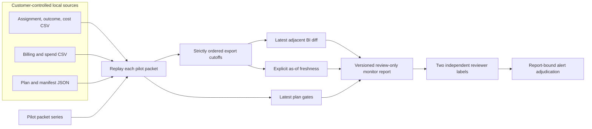

# Local continuous BI and proposal evaluation

The Gate 3 release is an **offline, review-only** monitor over read-only pilot exports. It has no scheduler, live connector, notification delivery, write credentials, or autonomous optimization. The reference fixture is synthetic. A customer pilot still requires permission, a predeclared measurement design, source-completeness checks outside this repository, and an independent reviewer.

## Data flow



Create packets using [`pilot`](read-only-pilot.md), then prepare a local series file. Paths are resolved relative to the series file's directory; absolute paths work too. Keep customer paths and exports out of the repository.

```json
{
  "schema_version": "growth-decision-monitor-series/v1",
  "snapshots": [
    {
      "packet": "packets/2026-01-10.json",
      "assignments": "exports/assignments.csv",
      "outcomes": "exports/outcomes.csv",
      "costs": "exports/costs.csv",
      "billing": "exports/billing.csv",
      "spend": "exports/spend.csv",
      "plan": "plan.json",
      "manifest": "manifests/2026-01-10.json",
      "seed": 1729,
      "resamples": 2000
    }
  ]
}
```

```bash
python3 -m growth_decision_engine bi-monitor \
  --series /path/to/private/series.json \
  --as-of 2026-01-11T00:00:00Z \
  --freshness-hours 24 \
  --output /path/to/private/monitor.json
```

`as_of` is mandatory so replay yields identical output. The monitor accepts 1–8 snapshots, each with a verified pilot packet and strictly increasing UTC export cutoff. It rejects tampered packets, changed experiment IDs, malformed series, duplicate packet paths, and a cutoff later than `as_of`. It checks the **latest adjacent pair** for removed or restated date/arm rows and a changed plan hash; it also reports failed sample, sample-ratio, and cost gates on the latest scorecard. It uses `age_hours > freshness_hours` to flag staleness. Added rows and source-file changes appear in `latest_diff` but do not alone trigger an alert. Every alert needs human interpretation. The `workload.bootstrap_unit_draws` field is a deterministic work count, **not** measured runtime, query cost, or USD.

Operators using [private local source snapshots](local-source-snapshot.md) can run `monitor-snapshots` over bundle directories instead of maintaining the series JSON. Optional independent inventory receipts bind each bundle before monitoring. Both commands produce the same versioned monitor protocol and remain offline, review-only tools.

## Independent alert review

After a monitor report is frozen, create a review file for two named **pseudonymous** reviewers. The command generates one entry per reviewer per alert and binds it to the SHA-256 of the exact monitor report bytes. Each reviewer independently replaces their `"unreviewed"` value with `"actionable"`, `"false_alarm"`, or `"uncertain"`. Keep the file local; do not include names, customer details, free-text notes, or source records.

```bash
python3 -m growth_decision_engine alert-review-template \
  --monitor /path/to/private/monitor.json \
  --reviewer-a reviewer_a --reviewer-b reviewer_b \
  --output /path/to/private/alert-reviews.json

python3 -m growth_decision_engine alert-review-eval \
  --monitor /path/to/private/monitor.json \
  --reviews /path/to/private/alert-reviews.json \
  --output /path/to/private/alert-review-result.json
```

The evaluator rejects an altered monitor report, missing or duplicate labels, an unknown alert, or one reviewer ID labeling the same alert twice. Two matching `actionable` labels count as reviewer-confirmed actionable; two matching `false_alarm` labels count as reviewer-confirmed false alarms. Disagreements and `uncertain` labels remain unresolved. `reviewer_confirmed_precision` divides confirmed actionable alerts by the sum of confirmed actionable and confirmed false alarms; it is `null` when there are no resolved alerts. Distinct pseudonyms do **not** prove two people reviewed independently. This is **reviewer consensus**, not independently established ground truth or operational impact. Source replay must be performed separately before evaluating labels.

## Analyst proposal contract benchmark

```bash
python3 -m growth_decision_engine demo --output outputs/demo-scorecard.json
python3 -m growth_decision_engine proposal-bench \
  --scorecard outputs/demo-scorecard.json \
  --suite growth_decision_engine/fixtures/proposal-bench.synthetic.json \
  --output outputs/proposal-bench.json
```

The five synthetic cases include a valid count citation, a fabricated pointer, an incorrect report hash, an unapproved write action, and **false prose citing a real path**. The last case is structurally accepted. The result reports structural contract correctness and the number of fixture-labeled unsupported findings accepted. Labels are authored in the suite, not inferred by software. This benchmark does **not** measure model accuracy, factual support on customer data, reviewer acceptance, or false-alert rate. A future semantic benchmark needs independently labeled findings, blinded reviewer adjudication, measured disagreement, and a representative distribution of pilot reports.

## Pilot evaluation before any production claim

| Measure | Definition | Current evidence |
| --- | --- | --- |
| Replay completeness | Verified snapshots / submitted snapshots | Exact by construction for a successful local run; source authenticity still unproven |
| Export freshness | Hours from latest declared cutoff to explicit `as_of` | Computed locally; cadence must be agreed with a pilot |
| Restatement detection | Changed or removed date/arm rows between adjacent verified packets | Synthetic and unit tested; source correction process untested |
| Reviewer-confirmed precision | Consensus actionable / (consensus actionable + consensus false alarm); unresolved excluded | Evaluator shipped; no real labels collected |
| Semantic support | Independently supported proposal findings / reviewed findings | Not measured; suite demonstrates a known failure mode |
| Review acceptance | Proposals accepted by a named operator / reviewed proposals | Not measured |
| Query and operating cost | Measured runtime, bytes read, platform API/query cost, reviewer minutes | No platform queries; runtime and reviewer cost not measured |

Do not use alert counts, structural benchmark pass rate, or generated proposal volume as evidence of customer value. Release beyond local pilots requires real labeled data, a source-system completeness check, measured alert precision and cost, and a documented operator action boundary.
