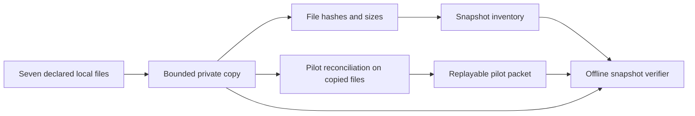

# Private local pilot snapshots

`snapshot-pilot` copies the seven declared pilot inputs into a new private directory, validates the copies by running the existing pilot reconciliation, and writes a packet plus a SHA-256 inventory. `verify-snapshot` checks file hashes and replays that packet. The bundle is **local**: no provider account is contacted, no permission is authenticated, and no source system is attested.



Create the destination under a customer-approved private directory **outside every Git repository**. Its parent must already exist, and the destination must not exist. The command creates a temporary directory with mode `0700`, writes files with mode `0600`, and renames the complete directory into place after reconciliation succeeds. Source symlinks and files exceeding the existing limits are rejected. A source whose size or modification metadata changes during copying is rejected. Failed runs remove the temporary directory.

```bash
python3 -m growth_decision_engine snapshot-pilot \
  --assignments /private/exports/assignments.csv \
  --outcomes /private/exports/outcomes.csv \
  --costs /private/exports/costs.csv \
  --billing /private/exports/billing.csv \
  --spend /private/exports/spend.csv \
  --plan /private/exports/plan.json \
  --manifest /private/exports/pilot-manifest.json \
  --directory /private/snapshots/pilot-001

python3 -m growth_decision_engine verify-snapshot \
  --directory /private/snapshots/pilot-001 \
  --expected-inventory-sha256 YOUR_INDEPENDENTLY_SAVED_DIGEST
```

The resulting directory contains `assignments.csv`, `outcomes.csv`, `costs.csv`, `billing.csv`, `spend.csv`, `plan.json`, `manifest.json`, `packet.json`, and `snapshot.json`. The inventory records each copied file's name, byte count and SHA-256, plus the packet hash and scoring parameters. `snapshot-pilot` prints `inventory_sha256`; keep that value in a separately controlled record. The verifier rejects missing, extra, symlinked, oversized, changed, or inconsistent files. If supplied, `--expected-inventory-sha256` also detects replacement of the inventory and all contents together.

For repeated exports from **the same experiment**, create a new bundle for each strictly later export cutoff. Monitor them in order without writing a path-heavy series file:

```bash
python3 -m growth_decision_engine monitor-snapshots \
  --snapshot /private/snapshots/pilot-001 \
  --snapshot /private/snapshots/pilot-002 \
  --expected-inventory-sha256 DIGEST_FOR_PILOT_001 \
  --expected-inventory-sha256 DIGEST_FOR_PILOT_002 \
  --as-of 2026-01-12T00:00:00Z \
  --freshness-hours 24 \
  --output /private/reports/bi-monitor.json
```

The number and order of expected hashes must match the snapshot arguments. `monitor-snapshots` verifies each bundle and then replays the packets for the same freshness, restatement and plan-gate report as `bi-monitor`. Its `series_sha256` hashes the ordered inventory-digest list, making it independent of local directory names. The output includes that list. A mismatch fails before a BI report is written. `change-preflight` can also point to files in these directories.

This is a stability and replay aid, **not** a trusted evidence vault. Source modification metadata is only a best-effort concurrent-change check; an adversary controlling the filesystem can replace an entire bundle and its inventory. An expected digest held separately can reveal that replacement, but SHA-256 is not a signature and the tool does not store or authenticate that external receipt. Filesystem permissions and retention depend on the host and customer policy. The tool does not encrypt files, authenticate collectors, prove export completeness, or resolve whether a real experiment was randomized. Do not copy customer exports to a shared or cloud-synced location without permission.
