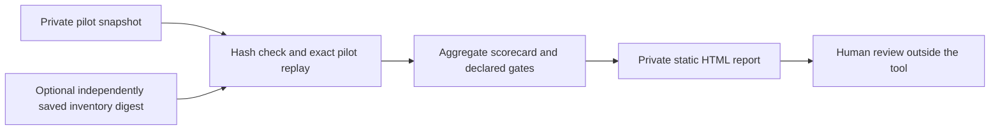

# Offline pilot review report

`render-report` turns one verified [private local pilot snapshot](local-source-snapshot.md) into a single HTML file that a reviewer can open offline. It shows aggregate contribution economics, the uncertainty interval, declared plan gates, ledger totals, input hashes, and the claim limits. It does not include assignment rows, transaction IDs, raw customer records, scripts, remote fonts, trackers, or network assets.



Create the output in an existing, customer-approved private directory **outside Git and outside the snapshot bundle**. The command refuses to overwrite a report and writes the new file with mode `0600`.

```bash
python3 -m growth_decision_engine render-report \
  --snapshot /private/snapshots/pilot-001 \
  --expected-inventory-sha256 YOUR_INDEPENDENTLY_SAVED_DIGEST \
  --output /private/reports/pilot-001-review.html
```

The optional expected digest checks the inventory against a receipt saved elsewhere. The renderer also compares the packet hash after verification before reading its aggregate fields. Customer-supplied experiment identifiers are HTML-escaped. The report visibly distinguishes the bundled synthetic example from operator-supplied data whose source remains unauthenticated. It never changes a decision status to approved.

This report is a communication artifact, not evidence that an experiment was correctly randomized, a plan was genuinely preregistered, or a source export was complete. Treat the aggregate economics and experiment identifier as potentially commercially sensitive. Verify the source bundle again if it changes, and keep the report under the same retention and sharing rules as the pilot packet.
