# Production architecture and failure boundaries

The shipped package is an offline reference kernel. A production service is a sequence of separately testable capabilities, not a larger `score()` function. The most consequential boundary is between **source observations**, **causal estimates**, and **approved actions**. A chart may show an association; only a credible design can support a causal estimate; neither authorizes an account mutation by itself.

```mermaid
flowchart LR
    subgraph Sources[Customer-controlled sources]
        EXP[Experiment assignment log]
        EVENT[Product and edge events]
        BILL[Billing and refund ledger]
        MEDIA[Media and creative costs]
        COMPUTE[Inference and infrastructure costs]
    end
    subgraph Ingest[Proposed authenticated read-only ingestion]
        AUTH[Scoped source credentials]
        RAW[Immutable source snapshot]
        CHECK[Schema, deduplication and consent checks]
        JOIN[Explicit unit and window joins]
    end
    subgraph Measure[Shipped local kernel and future scale-out]
        PLAN[Declared experiment plan]
        ECON[Contribution economics]
        EST[Intent-to-treat estimator]
        DIAG[Sample and cost diagnostics]
        BI[Daily BI and restatement detection]
        CARD[Versioned scorecard and verifier]
        LEDGER[Local billing and spend ledger reconciliation]
        PACK[Pilot packet and offline replay]
    end
    subgraph Action[Proposed action boundary]
        AGENT[Evidence-linked analyst proposals]
        REVIEW[Named human approval]
        CAP[Spend cap and rollback]
        ADAPTER[Platform API mutation]
    end
    EXP --> AUTH
    EVENT --> AUTH
    BILL --> AUTH
    MEDIA --> AUTH
    COMPUTE --> AUTH
    AUTH --> RAW --> CHECK --> JOIN
    JOIN --> ECON
    PLAN --> EST
    PLAN --> DIAG
    ECON --> EST --> CARD
    ECON --> BI --> CARD
    DIAG --> CARD
    BILL -. customer export .-> LEDGER
    MEDIA -. customer export .-> LEDGER
    COMPUTE -. customer export .-> LEDGER
    CARD --> PACK
    LEDGER --> PACK
    PACK -. proposed .-> AGENT --> REVIEW --> CAP --> ADAPTER
```

## Contracts between layers

| Boundary | Required invariant | Failure response |
| --- | --- | --- |
| Source to raw snapshot | Source identity, extraction window, cursor, file hash, permission scope | Quarantine; never infer missing records as zero outcomes |
| Raw to unit ledger | Stable experiment unit, one assignment, time-ordered outcome, explicit currency and cost allocation | Reject conflicting or unjoined records and report the mismatch rate |
| Unit ledger to estimator | Frozen eligibility rule, control/treatment counts, exposure and observation windows | Block causal claim when the rule changes after exposure |
| Estimator to scorecard | Versioned metric formula, uncertainty, guardrails, assumptions and source hashes | Emit inconclusive or blocked status instead of a winning label |
| Scorecard to agent | Evidence references resolve to immutable scorecard fields | Reject unsupported or uncited claims |
| Agent to platform | Human approval, scoped capability, spend cap, dry run, rollback | No mutation when any control is missing |

The current CLI implements the strict three-file join, declared plan checks, scorecard, daily BI, transaction-level billing/spend reconciliation, pilot packet, offline verifiers, a read-only external agent-proposal validator, local [provider export audits](provider-export-audits.md), and a replay-verified [offline BI monitor, two-reviewer alert adjudication, and proposal contract benchmark](continuous-bi.md). The local ledgers and provider projections are customer-controlled exports; they are not authenticated connectors. LLM execution, provider ingestion, scheduling, and the action boundary remain proposed. In particular, it has no authenticated API connector, event queue, durable source snapshot store, multi-tenant isolation, or write-capable platform adapter.

## Deployment topology to build next

1. **Read-only collector.** One connector process per provider, using least-privilege customer authorization. Capture extraction cursors, source timestamps, pagination counts, sampling flags, and hashes. Store raw exports in customer-owned object storage with retention and deletion policies.
2. **Normalization worker.** Convert source-specific records to versioned assignment, outcome, and cost tables. Keep source IDs and transformation version in a restricted provenance table; use pseudonymous unit IDs in the evaluation table. Never silently cross identity scopes or join on fuzzy personal traits.
3. **Portable analytical store.** Start with partitioned Parquet and a local SQL engine. Adopt Iceberg when concurrent writers, snapshot isolation, schema evolution, and table maintenance are justified by measured workload. The on-disk contract should remain exportable.
4. **Evaluation worker.** Run a pinned scorer image against a frozen source snapshot and plan. Write immutable report artifacts with input hashes, code revision, environment, warnings, and performance metrics. Re-run on late refunds or costs and record a restatement, rather than overwriting history.
5. **Review service.** Expose reports and agent proposals to named operators. Keep action execution in a separate service with narrow credentials, idempotency keys, limits, rollback, and an append-only audit trail.

Only compare BI snapshots after each scorecard has passed `verify` against its own source files and plan. `bi-diff` describes changes; it does not authenticate its input reports. `bi-monitor` replays each pilot packet against its declared local source files before the latest adjacent comparison, but still cannot authenticate source systems or verify the operator's permissions.

## The first two adapters

- **Feature-flag experiment:** maintain an independently exported assignment census, then use `exposure-audit` to compare customer-projected PostHog or Vercel flag events to that census. Join billing outcomes and allocated inference/infrastructure costs for the same units and fixed horizon. Validate provider event semantics and source counts against a permitted native export before calling this a provider adapter.
- **Edge analytics:** `cloudflare-audit` reads allowlisted HTTP Logpush NDJSON as descriptive context and reports declared job/upstream sampling. A sampled request count is not a unit-level assignment/outcome join; never feed it into the causal estimator as if it were a complete census.

Do not ship a generic adapter that accepts arbitrary columns with silent coercion. Each adapter needs a versioned source contract, fixture, negative tests, source coverage test, and documented capability limit.

## Operational targets to validate, not achieved claims

| Dimension | Proposed pilot gate | Measurement |
| --- | --- | --- |
| Source completeness | 100% of assignment IDs accounted for or explicitly quarantined | Reconciliation report per extraction window |
| Source freshness | Defined per source and decision deadline | Source event time to accepted ledger time |
| Join correctness | Zero silent many-to-many joins | Contract tests and sampled manual review |
| Reproducibility | Same inputs, plan and version yield the same report | Cross-machine checksum comparison |
| Isolation | No cross-tenant read path | Authorization and isolation tests |
| Mutation safety | Zero unapproved writes | Dry-run and denied-action tests |
| Economics | Positive verified incremental contribution over a locked baseline | Repeated customer-approved experiments |

No numeric latency, accuracy, or customer-benefit SLO is claimed until a representative pilot supplies the workload and baseline.
