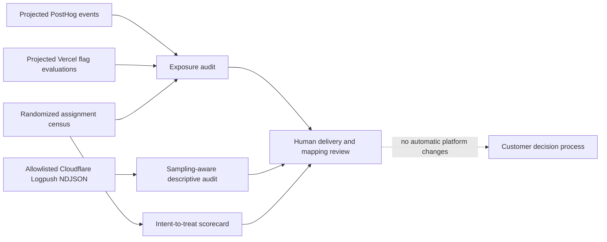

# Read-only provider export audits

These tools operate on customer-controlled local files. They do not authenticate to PostHog, Vercel, or Cloudflare, and the bundled examples are synthetic. They inspect evidence **around** the existing assignment census; they do not generate missing assignments or turn request logs into a causal experiment.

## PostHog and Vercel flag evaluations

PostHog experiments have feature-flag variants and exposure criteria; the exact exposure event and variant semantics must be resolved for a particular experiment before export. [PostHog's experiment guide](https://posthog.com/docs/experiments/no-code-web-experiments) describes configuring variants and exposure criteria. [Vercel's flags observability guide](https://vercel.com/docs/flags/observability) describes reporting evaluated flag values with `reportValue` or the Flags SDK. These signals are useful for checking delivery, but a flag evaluation is not a census of everyone randomized. [Vercel's Flags overview](https://vercel.com/docs/flags/vercel-flags) also describes experiments and measuring results in an analytics platform or warehouse.

`exposure-audit` accepts an **operator-projected**, versioned CSV, not a claim about either provider's native export columns:

```text
event_id,unit_id,flag_key,variant,observed_at
```

The operator must map the provider's immutable event identity to `event_id`, the exact experiment flag key to `flag_key`, the declared randomized unit to an already pseudonymized `unit_id`, the active value to `control` or `treatment`, and the UTC event time to `observed_at`. Resolve unit identity and variant mapping with the customer; do not fuzzy-match email, device, IP, or cookie values in this tool. All rows must belong to one flag. Provide `--expected-events` from a source-system control count where possible.

The audit rejects duplicate event IDs, unknown units, wrong flags, variants that contradict assignment, and events outside the assignment-to-observation window. Multiple matching evaluations for one unit are permitted. It reports distinct exposed units, coverage against assigned units, counts by arm, and how many assigned units have no matching exposure. Those missing units remain in the intent-to-treat scorecard. The count and unit mapping are operator supplied and require independent provider review for a real pilot.

```bash
python3 -m growth_decision_engine exposure-audit \
  --provider posthog \
  --assignments growth_decision_engine/fixtures/assignments.synthetic.csv \
  --exposures growth_decision_engine/fixtures/posthog-exposures.synthetic.csv \
  --plan growth_decision_engine/fixtures/plan.synthetic.json \
  --flag-key checkout-experiment --expected-events 7 \
  --output outputs/posthog-exposure-audit.json

python3 -m growth_decision_engine exposure-audit \
  --provider vercel \
  --assignments growth_decision_engine/fixtures/assignments.synthetic.csv \
  --exposures growth_decision_engine/fixtures/vercel-exposures.synthetic.csv \
  --plan growth_decision_engine/fixtures/plan.synthetic.json \
  --flag-key checkout-experiment --expected-events 8 \
  --output outputs/vercel-exposure-audit.json
```

## Cloudflare HTTP Logpush context

[Cloudflare's Logpush configuration documentation](https://developers.cloudflare.com/logs/logpush/logpush-job/api-configuration/) describes configurable fields, RFC3339 timestamps, NDJSON output, and job sampling; it notes that `SampleInterval` is a separate upstream sampling mechanism where present. [The dataset reference](https://developers.cloudflare.com/logs/logpush/logpush-job/datasets/) explains that field availability depends on dataset and plan. Export an `http_requests` projection containing only `RayID`, `EdgeStartTimestamp`, `EdgeResponseStatus`, and optionally `SampleInterval`. The parser rejects extra fields, including IPs and request URIs.

The separate job manifest has exactly these fields:

```json
{
  "schema_version": "growth-decision-cloudflare-logpush/v1",
  "dataset": "http_requests",
  "sample_rate": 0.5,
  "expected_records": 5,
  "output_format": "ndjson",
  "timestamp_format": "rfc3339"
}
```

Obtain `sample_rate` and `expected_records` from the job configuration and source destination control totals when possible. The CLI cannot authenticate either. It reports observed status-class counts and an **observed** 5xx fraction, never an extrapolated request count or treatment effect. `known_sampled` is returned if the declared job rate is below one or a record's `SampleInterval` exceeds one. If intervals are absent and job rate is one, upstream sampling stays unknown.

```bash
python3 -m growth_decision_engine cloudflare-audit \
  --logs growth_decision_engine/fixtures/cloudflare-http.synthetic.ndjson \
  --job-manifest growth_decision_engine/fixtures/cloudflare-job.synthetic.json \
  --output outputs/cloudflare-audit.json
```



These are **local contract implementations**, not validated native integrations. To complete the provider-adapter roadmap gate, run contract tests against customer-permitted exports from each provider, compare counts and fields to the provider source, document retention and sampling, and measure join errors. A signed-off export mapping should be versioned per provider/project because flag instrumentation and log fields can change.
