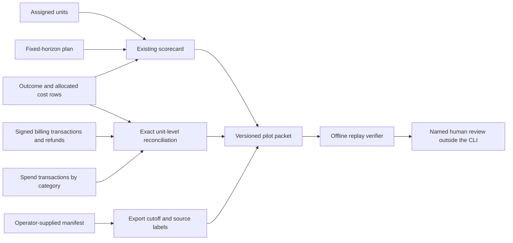

# Read-only signup-to-paid pilot

The pilot workflow starts from customer-controlled, de-identified exports on a local machine. It does not request source credentials or call provider APIs. The operator must obtain written permission outside this tool and keep the evidence of that permission in the customer's approved system. The manifest records an opaque reference to it; that reference is **not proof of permission**.

## Input boundary

Provide the existing `assignments.csv`, `outcomes.csv`, `costs.csv`, and fixed-horizon `plan.json` used by `score`, plus two independently exported transaction ledgers and a manifest. The billing ledger contains `transaction_id,unit_id,posted_at,signed_amount_usd`. Positive transactions and negative refunds net to each unit's `net_revenue_usd`. The spend ledger contains `transaction_id,unit_id,category,posted_at,amount_usd`, where category is exactly one of `variable`, `media`, `inference`, `infrastructure`, or `experiment`. The sum for each unit and category must match the outcome/cost export, to the cent. A missing ledger entry represents zero only when the corresponding scored amount is zero. The implementation rejects duplicate transaction IDs, unknown units, malformed timestamps, late transactions, and unmatched amounts.

The manifest is UTF-8 JSON with exactly these fields:

```json
{
  "schema_version": "growth-decision-pilot/v1",
  "experiment_id": "example-001",
  "source_owner": "opaque customer reference",
  "permission_reference": "opaque internal approval reference",
  "export_cutoff": "2026-01-10T00:00:00Z",
  "expected_rows": {
    "assignments": 8,
    "outcomes": 8,
    "costs": 8,
    "billing": 6,
    "spend": 37
  },
  "expected_net_revenue_usd": "500.00",
  "expected_total_cost_usd": "237.00",
  "source_labels": {
    "assignments": "assignment export identity",
    "outcomes": "outcome export identity",
    "costs": "cost allocation export identity",
    "billing": "billing ledger export identity",
    "spend": "spend ledger export identity"
  }
}
```

Use opaque labels without names, account IDs, credentials, or personal information. `experiment_id` must match the plan and `export_cutoff` must be at or after the observation window. Obtain `expected_rows` and financial control totals independently from the source systems where possible, rather than deriving them from the same exported files. The CLI checks these figures exactly but cannot authenticate how they were obtained. Source labels and permission status remain operator declarations.

## Run and independently replay

From the repository root, the bundled example can be executed without external data:

```bash
python3 -m growth_decision_engine pilot \
  --assignments growth_decision_engine/fixtures/assignments.synthetic.csv \
  --outcomes growth_decision_engine/fixtures/outcomes.synthetic.csv \
  --costs growth_decision_engine/fixtures/costs.synthetic.csv \
  --billing growth_decision_engine/fixtures/billing.synthetic.csv \
  --spend growth_decision_engine/fixtures/spend.synthetic.csv \
  --plan growth_decision_engine/fixtures/plan.synthetic.json \
  --manifest growth_decision_engine/fixtures/pilot.synthetic.json \
  --output outputs/pilot-packet.json

python3 -m growth_decision_engine verify-pilot \
  --assignments growth_decision_engine/fixtures/assignments.synthetic.csv \
  --outcomes growth_decision_engine/fixtures/outcomes.synthetic.csv \
  --costs growth_decision_engine/fixtures/costs.synthetic.csv \
  --billing growth_decision_engine/fixtures/billing.synthetic.csv \
  --spend growth_decision_engine/fixtures/spend.synthetic.csv \
  --plan growth_decision_engine/fixtures/plan.synthetic.json \
  --manifest growth_decision_engine/fixtures/pilot.synthetic.json \
  --packet outputs/pilot-packet.json
```

`verify-pilot` recomputes the packet from the original inputs. A changed ledger, manifest, plan or scorecard invalidates replay. The packet contains hashes of all input exports, exact row-count and financial-control reconciliation, per-unit ledger totals, the scored economics, and `human_review_status: pending`. It cannot set approval or make a platform write. Do not commit pilot inputs or packets containing customer data; the `outputs/` directory is ignored by Git, but use the customer's approved storage and retention rules.

For multi-pass reconciliation, [`snapshot-pilot`](local-source-snapshot.md) can first copy the seven inputs to a private directory outside Git and run the pilot against those copies. `verify-snapshot` then checks the copied files, inventory and packet together. This narrows accidental source-change risk during replay; the copy is not independently authenticated evidence.



## Gate to a real pilot

1. A customer approves a defined data scope and fixed experiment plan before exposure; preserve the approval and plan lock outside this repository.
2. The customer exports de-identified unit rows plus an independent transaction-level billing and spend ledger. The operator checks source completeness, refund handling, allocation method, currency and cutoff in the source systems.
3. Run `pilot` and `verify-pilot` locally. Any reconciliation error stops the packet. A human reviews assignment integrity, interference, missingness, interval calibration, unit economics and all limitations.
4. Record the review and any business decision in the customer's approved workflow. Re-run on late refunds or corrected costs; retain both packets and explain the restatement.

The implementation completes the **offline pilot tooling**, not a live customer pilot. No authenticated provider connector, independent permission attestation, provider transaction completeness proof, or deployed multi-tenant service exists yet. A pilot is complete only after a consenting customer supplies and reviews real exports.
